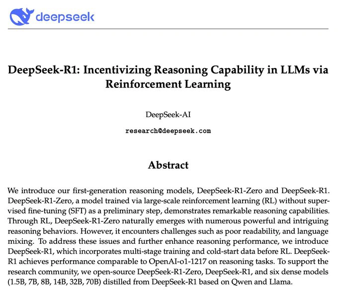
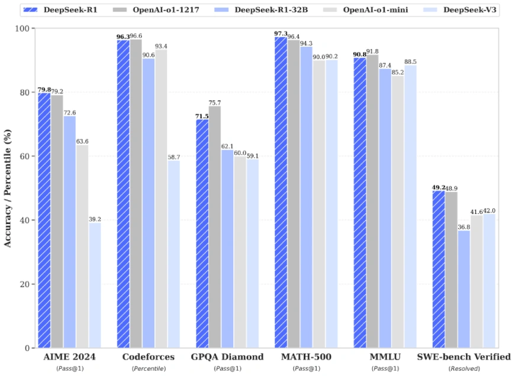
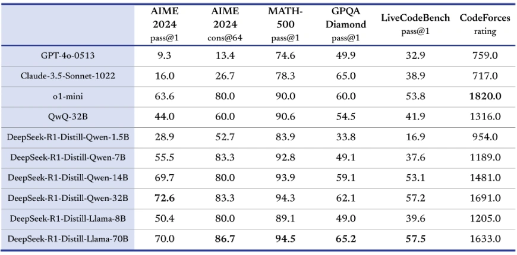

DeepSeek AI has just unveiled its highly anticipated **DeepSeek R1** reasoning models, setting a **new gold standard** in the world of generative artificial intelligence! This groundbreaking release is not just an incremental step forward—it's a monumental leap that's poised to transform the AI landscape forever.

With an unwavering focus on advanced **reinforcement learning (RL)** techniques and a passionate commitment to **open-source principles**, DeepSeek R1 delivers **unparalleled reasoning capabilities** while remaining **accessible** to researchers, developers, and enthusiasts **worldwide**. This means that the power of cutting-edge AI reasoning is now within everyone's reach.

But the excitement doesn't stop there. DeepSeek R1 isn't just competing with existing models; it's **surpassing them**. In several critical benchmarks, it has outperformed OpenAI’s o1 model, showcasing superior prowess in complex tasks. With DeepSeek R1, the AI community is buzzing with a compelling question: **Could this be the end of OpenAI's LLM supremacy?**

Let's dive deeper to explore this game-changing development!

---

## **Introducing DeepSeek R1: Revolutionizing AI Reasoning**

**DeepSeek R1** is more than just a large language model (LLM); it's a **revolutionary leap** in AI reasoning. By leveraging advanced **reinforcement learning**, DeepSeek R1 significantly enhances reasoning capabilities **without the heavy reliance on supervised fine-tuning (SFT)** typically seen in other models. This innovative approach addresses one of AI's biggest challenges: **boosting reasoning skills without extensive SFT dependency**.

### **Unmatched Reasoning Abilities**

DeepSeek R1 is powered to tackle **complex tasks** like mathematics, coding, and logic with a proficiency that's never been seen before. Its advanced RL training allows it to understand and process intricate problems, delivering solutions that are both accurate and insightful.

But what truly sets DeepSeek R1 apart is its ability to **provide transparency into its reasoning process**. Users can now **debug prompts** and **see into the model's thought process**, offering an unprecedented level of interaction and control. This breakthrough transforms the AI from a black box into an interactive partner, enhancing trust and collaboration between humans and machines.

### **Accessibility Like Never Before**

Committed to **open-source principles**, DeepSeek AI ensures that DeepSeek R1 remains **accessible** to everyone. Researchers and developers around the globe can explore, contribute to, and benefit from this cutting-edge technology. This democratization of AI fosters innovation and accelerates advancements across the industry.

---

## **A New Challenger to OpenAI's Supremacy**

DeepSeek R1's remarkable performance has positioned it as a formidable contender against established giants like OpenAI's o1 model. On numerous benchmarks, DeepSeek R1 has not only matched but **outclassed the competition**, particularly in areas requiring deep reasoning and logic.

This achievement has sparked excitement and speculation within the AI community. **Is DeepSeek R1 the new leader in LLM technology?** With its superior reasoning capabilities and open accessibility, many believe that DeepSeek AI is ushering in a new era of AI dominance.

---

## **Unlocking the Future of AI Interaction**

DeepSeek R1 isn't just about raw power; it's about **enhancing the way we interact with AI**. The ability to **debug prompts** and **observe the reasoning process** empowers users to refine and tailor interactions, leading to more meaningful and productive outcomes.

Imagine being able to see exactly how the AI arrives at an answer, understanding its logic, and adjusting your prompts to guide it more effectively. This level of transparency fosters a deeper collaboration between humans and AI, opening doors to innovations previously thought impossible.

---

## **Join the Revolution with DeepSeek R1**

The release of DeepSeek R1 marks a pivotal moment in AI history. It's an invitation to the global community to **join a revolution**—one where AI is more powerful, more accessible, and more collaborative than ever before.

Whether you're a researcher pushing the boundaries of what's possible, a developer crafting the next big application, or an enthusiast eager to explore, DeepSeek R1 offers the tools and capabilities to **turn vision into reality**.

---

**The Future is Here**

With DeepSeek R1, DeepSeek AI hasn't just developed a new model; they've **redefined the paradigm** of what AI can achieve. The ability to harness unparalleled reasoning, delve into the AI's thought process, and do so within an open and accessible framework is a game-changer.

**Excitement is in the air**, and the possibilities are endless. The question isn't just whether DeepSeek R1 will challenge existing leaders—it's how it will **shape the future** of AI for years to come.

**Get Ready to Dive In**

So, are you ready to explore the cutting edge of AI technology? Dive into DeepSeek R1 today and be part of the movement that's transforming the AI world. The future is not just approaching—**it's here**, and it's more exciting than ever!

## Karpathy Highlights AI Efficiency with DeepSeek R1

Andrej Karpathy, the Slovakia-born AI expert, served as Director of Artificial Intelligence and Autopilot Vision at Tesla. He co-founded and formerly worked at OpenAI, where he specialized in deep learning and computer vision. Karpathy has offered insightful commentary on the astonishing rise of DeepSeek R1. This open-source AI model has captivated the tech world by achieving performance on par with leading models but at a fraction of the development cost.

DeepSeek R1 was trained using just 2,788 GPUs, with an estimated expenditure of around $6 million—a stark contrast to the reported $100 million spent on training GPT-4. Karpathy addressed this remarkable feat, stating, "Does this mean you don't need large GPU clusters for frontier LLMs? No, but you have to ensure that you're not wasteful with what you have, and this looks like a nice demonstration that there's still a lot to get through with both data and algorithms."

His comments underscore a significant shift in the AI landscape: the emphasis on efficiency and optimization over sheer scale. Karpathy's perspective suggests that innovation in AI can thrive through smart utilization of resources and refined algorithms, challenging the notion that only vast computational power can drive breakthroughs.

The success of DeepSeek R1 not only validates the potential of open-source models but also ignites excitement about the future of accessible and cost-effective AI development. Karpathy's insights resonate with industry leaders who advocate for democratizing AI technology, fostering transparency, and spurring healthy competition.

DeepSeek R1's emergence signals a transformative moment in AI, where strategic ingenuity outpaces brute-force approaches. As Karpathy highlights, there remains vast potential to unlock through meticulous attention to data and algorithmic refinement, paving the way for innovative advancements without prohibitive costs.

## Training Process: A Revolutionary Leap Forward

### Unleashing the Power of Reinforcement Learning

**DeepSeek R1** is a trailblazing model that is reshaping the landscape of artificial intelligence. Departing from traditional paradigms, DeepSeek R1 is trained **exclusively** through **reinforcement learning (RL)**, eschewing the conventional supervised fine-tuning route. This innovative methodology empowers the model to organically develop sophisticated reasoning abilities, such as self-verification, introspection, and the extraordinary **Chain-of-Thought (CoT)** reasoning. The model doesn't just learn; it evolves, mirroring the way humans refine their thinking through experience.

#### An Exciting Reward Paradigm

At the core of this groundbreaking training lies an **exhilarating reward system** that propels the model towards excellence. DeepSeek R1 earns rewards not only for achieving stellar accuracy on specific task benchmarks but also for producing reasoning outputs that are **structured, readable, and coherent**. This dual focus ensures that the model doesn't just provide correct answers—it communicates them in a way that's transparent and understandable, enhancing user trust and facilitating deeper engagement.

#### Navigating the Best Paths to Excellence

Embracing the exploratory spirit of RL, the model generates **multiple reasoning trajectories** during training. Think of it as charting numerous potential paths through a complex problem space. The most effective and high-performing trajectories are selected to steer further training, akin to choosing the best routes in a vast network to reach an optimal destination. This process of continual selection and refinement ensures that DeepSeek R1 perpetually advances, pushing the frontiers of AI reasoning capabilities.

### Kickstarting with Human Wisdom

Recognizing the value of human expertise, DeepSeek R1's training was initiated with carefully crafted, **human-annotated examples** of detailed CoT reasoning. This initial infusion of human insight serves as a catalyst, aligning the model's outputs with human expectations right from the start. By doing so, the often challenging gap between the raw outputs of pure RL training—which can be fragmented or opaque—and the polished, high-quality reasoning that users demand is bridged. The result is a model that not only thinks but **thinks like us**.

### A Multi-Stage Training Pipeline Designed for Mastery

The training pipeline is meticulously designed to cultivate and refine the model's reasoning prowess through a series of strategic stages.

#### **Stage 1: Pretraining with Human Insights**

The journey commences with the model being primed using a handpicked dataset of human annotations. This foundational stage lays down the essential reasoning frameworks and patterns, providing a robust scaffold upon which advanced capabilities are built. The model absorbs the nuances of human thought processes, setting the stage for sophisticated reasoning.

#### **Stage 2: Dynamic Reinforcement Learning**

Armed with this foundational knowledge, DeepSeek R1 delves into the dynamic world of RL. Here, it engages in a diverse array of tasks, earning rewards that incentivize not just accuracy but also the coherence and alignment of its reasoning with desired outcomes. This stage is where the model truly comes alive, learning from successes and setbacks alike, and continuously refining its approach.

#### **Stage 3: Refinement through Top-Tier Samples**

In the final training stage, DeepSeek R1 is fine-tuned using the top-performing reasoning patterns unearthed during the RL phase. By concentrating on these exemplary samples, the model hones its abilities, achieving a level of precision and sophistication that is nothing short of extraordinary. This meticulous refinement ensures that the model's reasoning is not only accurate but also elegantly articulated.

### Distillation: Compacting Brilliance without Compromise

Understanding the importance of efficiency and accessibility, **distillation techniques** are employed to compress larger models into more compact, efficient versions. This process maintains the powerful reasoning capabilities of models like DeepSeek R1 while significantly reducing computational overhead. These distilled models are a testament to the commitment to making advanced AI accessible, providing the same groundbreaking functionalities in a more agile and cost-effective package.

### Looking Ahead: The Future of AI Reasoning

DeepSeek R1 represents a monumental step forward in AI training and reasoning. By harnessing the full potential of reinforcement learning and combining it with human insights, a model has been created that not only meets but **exceeds** expectations. Its ability to think critically, reason transparently, and communicate effectively opens up new horizons in fields ranging from scientific research to complex problem-solving and beyond.

The cusp of a new era in artificial intelligence is here—one where machines can reason and learn in ways that closely mirror human cognition. **DeepSeek R1 is at the forefront of this revolution**, and the incredible advancements and applications that lie ahead are eagerly anticipated.

## DeepSeek R1: A Revolutionary Leap in Advanced Language Models

DeepSeek R1 signifies a monumental advancement in the realm of language models, introducing a suite of innovative models that redefine the standards of reasoning capabilities and benchmark performances. This release comprises two core models and six distilled variants, each engineered to excel in complex problem-solving and knowledge-intensive tasks.

---

### Core Models

#### DeepSeek-R1-Zero

DeepSeek-R1-Zero stands as the foundational model in the R1 series, characterized by its unique training methodology. Unlike traditional models that rely heavily on supervised fine-tuning, DeepSeek R1 is trained **exclusively through reinforcement learning (RL)** on a base model. This unconventional approach empowers the model to develop advanced reasoning behaviors organically, such as **self-verification** and **reflection**, essential for tackling intricate tasks.

**Benchmark Achievements:**

- **AIME 2024:** Demonstrated exceptional performance on the American Invitational Mathematics Examination 2024, showcasing its mathematical prowess.
- **Codeforces:** Achieved notable results in competitive programming challenges, reflecting strong algorithmic understanding.

**Challenges:**

While DeepSeek-R1-Zero excels in reasoning, it encounters issues with **readability** and **language mixing**. The absence of cold-start data and structured fine-tuning results in responses that may lack polish and consistency, underscoring the trade-offs of its RL-only training approach.

---

#### DeepSeek-R1

Building upon the strengths of DeepSeek-R1-Zero, DeepSeek-R1 integrates **cold-start data** comprising human-annotated long **chain-of-thought (CoT)** examples to enhance its initial training phase. This addition establishes a firmer foundation for logical reasoning and coherent responses.

**Innovative Training Regime:**

- **Multi-Stage Training:** Incorporates a sophisticated, multi-stage training pipeline that goes beyond conventional methods.
    - **Stage 1:** Supervised fine-tuning using extensive CoT examples to instill structured reasoning patterns.
    - **Stage 2:** **Reasoning-Oriented Reinforcement Learning**, focusing on refining problem-solving abilities and logical deduction.
    - **Stage 3:** **Rejection Sampling and Alignment Techniques** to ensure outputs align with human preferences and maintain high-quality standards.

**Benchmark Dominance:**

DeepSeek-R1 competes directly with leading proprietary models, notably OpenAI's o1-1217:

- **AIME 2024:** Achieved a **Pass@1 score of 79.8%**, marginally surpassing OpenAI's model, highlighting superior mathematical reasoning.
- **MATH-500:** Recorded a **Pass@1 score of 97.3%**, demonstrating parity with OpenAI's performance and showcasing near-perfect accuracy in complex mathematical tasks.

**Expertise Areas:**

- **Knowledge-Intensive Tasks:** Exceptional in fields requiring deep understanding and extensive knowledge bases.
- **STEM-Related Challenges:** Excels in science, technology, engineering, and mathematics problems, indicating robust analytical capabilities.
- **Coding and Programming:** Performs admirably in coding challenges, reflecting strong comprehension of programming concepts and logical structures.

---

### Distilled Models

In a groundbreaking initiative to democratize access to advanced AI capabilities, DeepSeek-AI introduces distilled versions of the R1 model. These models are designed to be **smaller and computationally efficient** without compromising on the reasoning abilities inherited from their larger counterparts.

**Distilled Series:**

- **Qwen Series:** Focused on optimizing performance for environments with limited computational resources while maintaining high reasoning proficiency.
- **Llama Series:** Tailored for versatility and adaptability, suitable for integration into a wide array of applications and platforms.

**Competitive Edge:**

The distilled models not only **outperform open-source competitors** like QwQ-32B-Preview but also hold their ground against proprietary models such as OpenAI's o1-mini. This achievement underscores the efficiency of DeepSeek-AI's distillation techniques in retaining core functionalities and performance metrics.

---

## Key Highlights of DeepSeek R1

DeepSeek R1 models are meticulously engineered to **rival and surpass** some of the most advanced large language models (LLMs) in the industry. Their performance on critical benchmarks exemplifies this ambition:

### Benchmark Excellence

- **AIME 2024 (Pass@1):** Demonstrated outstanding mathematical problem-solving skills, achieving a top-tier score that marginally outperforms leading proprietary models.
- **MATH-500:** Attained near-perfect accuracy, with a **Pass@1 score of 97.3%**, affirming its exceptional capability in mathematical reasoning and complex computations.
- **Codeforces:** Excelled in coding challenges, reflecting adeptness in programming, algorithmic thinking, and logical analysis.

### Comparative Performance

When benchmarked against industry titans such as OpenAI’s o1-1217 and Anthropic’s Claude Sonnet 3, DeepSeek R1 models exhibit **competitive or superior performances**. This level of achievement is particularly noteworthy given the open-source nature of DeepSeek R1, which is unparalleled among models of its caliber.

### Accessibility and Cost-Effectiveness

DeepSeek R1's **open-source availability** positions it as a highly accessible and cost-effective alternative to proprietary models. By reducing barriers to adoption, it empowers a broader community of developers, researchers, and organizations to leverage cutting-edge AI capabilities without the constraints of restrictive licensing or high operational costs.

---

## DeepSeek R1: Transforming the AI Landscape

The introduction of DeepSeek R1 marks a significant stride towards democratizing advanced AI technologies. Its combination of **innovative training methodologies**, **superior benchmark performances**, and **accessible distributions** sets a new precedent in the development and dissemination of large language models.

### Pioneering Training Approaches

- **Reinforcement Learning Focus:** DeepSeek R1's RL-only training emphasizes the potential of reinforcement learning in developing sophisticated reasoning without extensive supervised data.
- **Multi-Stage Enhancements:** DeepSeek-R1's incorporation of cold-start data and rejection sampling showcases how hybrid training regimes can produce models that excel in both reasoning and language generation.

### Democratizing Advanced AI

By releasing both core and distilled models openly, DeepSeek-AI accelerates the pace of innovation:

- **Research Advancement:** Provides researchers with advanced tools to explore new frontiers in AI without prohibitive costs.
- **Educational Empowerment:** Enables educational institutions to incorporate state-of-the-art AI into curricula, fostering the next generation of AI experts.
- **Industry Innovation:** Allows startups and enterprises to integrate top-tier AI capabilities into products and services, driving competitive advantages.

### Future Implications

DeepSeek R1's success paves the way for future developments:

- **Enhanced Collaboration:** Open-source models encourage community contributions, leading to continuous improvements and adaptations.
- **Ethical AI Development:** Transparent models facilitate better oversight and understanding of AI behaviors, promoting responsible AI usage.
- **Global Impact:** Accessibility ensures that AI advancements benefit a global audience, bridging gaps between different regions and sectors.

---

## **Unbeatable Pricing That Unlocks New Possibilities!**

Get ready to revolutionize your AI experience with **DeepSeek-R1's** groundbreaking pricing! For an astonishingly low **$0.14 per million tokens** on cache hits, DeepSeek-R1 doesn't just make advanced AI accessible—it makes it **unbelievably affordable**.

Imagine the projects you can bring to life when cost is no longer a barrier. This incredible affordability opens up a world of opportunities for developers, startups, and enterprises alike. Scale your applications, process vast datasets, and innovate like never before without worrying about soaring expenses!

To truly grasp how exceptional this value is, consider this: **OpenAI's O1-preview charges start at $7.50 per million tokens** on cache hits—that's **over 50 times more expensive** than DeepSeek-R1! And it doesn't stop there; their costs can escalate to **$15.00 per million tokens** otherwise. With DeepSeek-R1, you're sidestepping these hefty fees and keeping your budget firmly in check.

**Why settle for less when you can have more for less?**

- **Empower Innovation**: With such low costs, allocate your resources to what truly matters—developing groundbreaking solutions and accelerating growth.
- **Scale Effortlessly**: High costs shouldn't limit your potential. DeepSeek-R1's efficiency supports your ambitions, no matter how big they are.
- **Maximize ROI**: Reduce overheads and increase profitability by cutting down on one of the largest expenses in AI deployment.

**Elevate Your Projects Without Elevating Your Costs**

Break free from financial constraints and let your imagination soar. DeepSeek-R1 is more than just a cost-effective solution; it's a catalyst for innovation. Whether you're:

- Crafting intelligent chatbots,
- Analyzing complex data patterns,
- Enhancing user experiences with personalized content,
- Exploring new frontiers in AI and machine learning,

Don't let exorbitant prices hold you back. DeepSeek-R1 is your partner in success. Embrace the future of AI with DeepSeek-R1's unmatched pricing and unleash the full potential of your projects. This isn't merely a cost-effective AI model; it's your golden ticket to unlimited innovation and an open invitation to unleash your boundless creativity!

## Applications

**Get ready to revolutionize your world with DeepSeek-R1!** This groundbreaking model is redefining what's possible across multiple domains, and we're thrilled to share its incredible applications with you:

- **🌟 STEM Education:** Imagine a classroom where complex mathematical concepts become interactive adventures! DeepSeek-R1 excels in math-intensive benchmarks, making it an invaluable assistant for educators and students. From unraveling intricate equations to exploring advanced theories, this model transforms learning into an exciting journey. **Empower your curiosity and conquer challenges like never before!**

- **🚀 Coding and Software Development:** Developers, your ultimate coding companion has arrived! With stellar performance on platforms like Codeforces and LiveCodeBench, **DeepSeek-R1 is set to turbocharge your development process.** Whether you're debugging, optimizing algorithms, or crafting innovative solutions, this model is your ideal partner in code. **Accelerate your projects and unleash your creativity with unprecedented efficiency!**

- **🔮 General Knowledge Tasks:** Unlock the universe of information with DeepSeek-R1's unparalleled fact-based reasoning. Its prowess in benchmarks like GPQA Diamond positions it as a **powerhouse for handling general knowledge queries with precision and depth.** From historical insights to scientific discoveries, this model provides accurate and insightful answers. **Dive deep into knowledge and satisfy your intellectual curiosity like never before!**

But that's just the beginning! **DeepSeek-R1's versatile architecture opens doors to endless possibilities:**

- **💡 Innovation Across Industries:** From healthcare analytics to financial forecasting, DeepSeek-R1 is poised to make waves in various sectors. Imagine interpreting complex medical data with ease or predicting market trends with remarkable accuracy!

- **🌐 Global Collaboration:** Break language barriers and foster international collaboration. DeepSeek-R1's advanced language capabilities make cross-cultural communication seamless and effective.

- **🎓 Research and Development:** Propel your research projects forward. With access to vast amounts of information and advanced reasoning skills, DeepSeek-R1 is the ultimate tool for academics and professionals pushing the boundaries of knowledge.

**The future is here, and it's brighter than ever with DeepSeek-R1!** Embrace this cutting-edge technology and be a part of the revolution that's transforming the way we learn, create, and explore. **Get ready to elevate your potential and achieve extraordinary feats—because with DeepSeek-R1, the sky's not the limit; it's just the beginning!**

## Conclusion

DeepSeek R1 emerges as a **trailblazer** in the AI industry, combining **cutting-edge performance** with **unprecedented accessibility**. Its models not only match but, in some areas, surpass the capabilities of established proprietary systems. By focusing on model differences, innovative training techniques, and benchmark excellence, DeepSeek-AI solidifies its position as a leader in AI development.

The excitement surrounding DeepSeek R1 is palpable, as it opens new avenues for exploration, application, and collaboration. Its impact is set to resonate across academic, professional, and commercial domains, heralding a new era where advanced AI is within reach for all who wish to harness its potential.

---

*DeepSeek R1 is not just a step forward—it's a giant leap towards a future where the most powerful tools of artificial intelligence are available to everyone, fueling innovation and progress across the globe.*

**By open-sourcing the groundbreaking DeepSeek-R1 models—including the highly efficient distilled versions—DeepSeek-AI is unleashing unparalleled reasoning capabilities upon the entire AI community!** This monumental move isn't just about democratizing access; **it's about sparking a global wave of collaboration and igniting the flames of innovation like never before.**

---

As we stand on the cusp of an AI renaissance, **DeepSeek-R1 shines brilliantly as a beacon of progress**, seamlessly merging the freedom of open-source with cutting-edge performance that rivals the most advanced proprietary systems. **This fusion empowers researchers, developers, and enthusiasts around the world to push the boundaries of reasoning tasks**, opening doors to breakthroughs across industries—from healthcare and finance to education and beyond.

With the release of DeepSeek-R1, **DeepSeek-AI is not just participating in the AI revolution—they're propelling it forward**, setting new standards for what can be achieved when we share knowledge and tools openly. **The ripple effects of this release will accelerate advancements**, foster unprecedented collaboration, and fuel a new era of innovation that stands to benefit all of humanity.

Join us in this exciting journey. **Embrace the power of open-source with DeepSeek-R1, and together, let's redefine the possibilities of artificial intelligence!** The future is not just near—**it's here, and it's open-source**.

